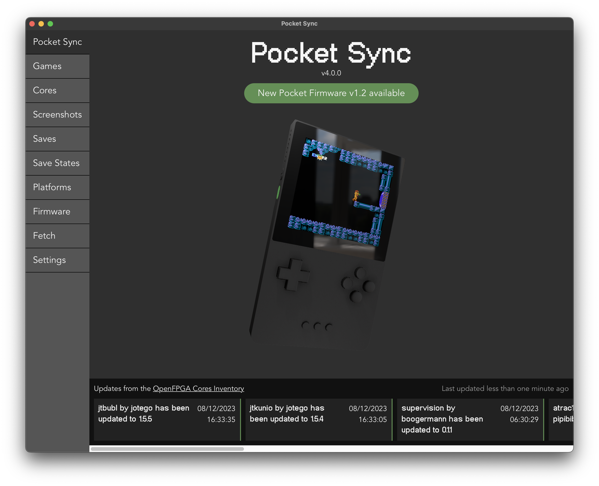
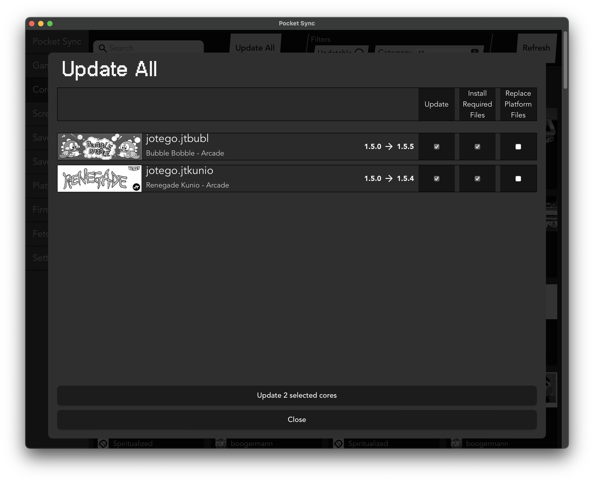
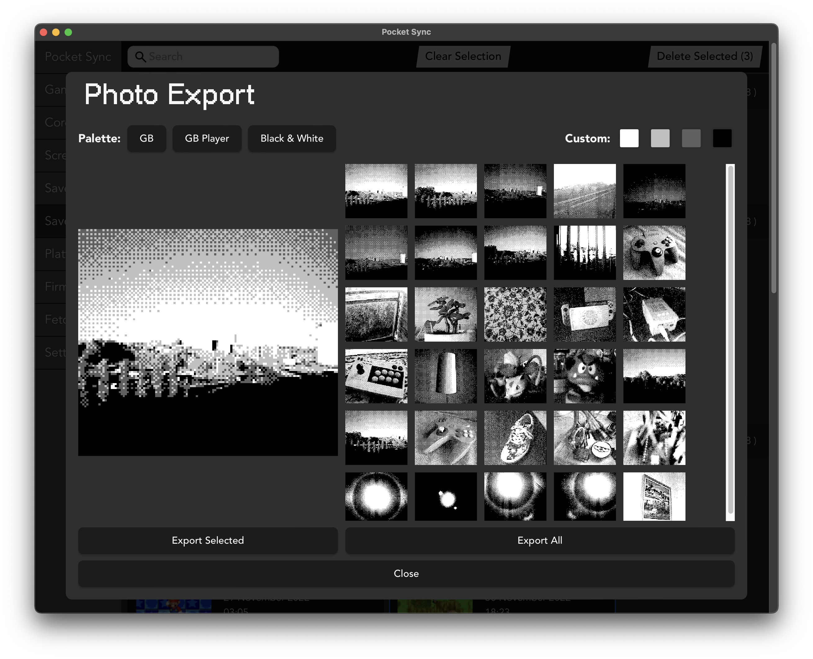

# pocket-sync

> "And fan-created apps let you load up a microSD card quickly and effortlessly."

<p align="right"> <a href="https://www.wired.com/review/analogue-pocket/#:~:text=And%C2%A0fan%2Dcreated%20apps%20let%20you%20load%20up%20a%20microSD%20card%20quickly%20and%20effortlessly">wired.com - Review: Analogue Pocket</a> </p>

A Windows / Mac / Linux GUI to do _stuff_ with the Analogue Pocket.






Features:

- Browse, configure, & install cores
- Export corrected & upscalled screenshots
- Backup & restore save files
- Quick links to open game file folders
- Browse & manage (bulk delete) save states
- Export GB Camera photos
- Automatically copy files over to the Pocket

## Installation

- Download the installer for your platform from [The Latest Release](https://github.com/neil-morrison44/pocket-sync/releases/latest)
- Note you'll need to click through to allow the application on Windows & right click to allow the application on MacOS since I can't be bothered setting up (& paying yearly for) the signing process
- The SD card will need to have been initialised by the Pocket to get recognised
- Plug in your Pocket / put in the SD card, click "Connect to Pocket", select the root folder (the one with Assets & Cores & Saves etc in it) and go
- It'll create a `pocket_sync.json` file on to your pocket to hold config on first run

## Windows Defender (& other AntiVirus) warnings

If this starts happening again let me know & I'll resubmit the app to the Windows Defender team to have them change the virus definitions since it's a false positive.

## Philosophy

- What this purposely _isn't_ is a way to install 100 Cores in 20 seconds without really knowing what any of them are (however you can "Update All")
- I'll not be adding any sort of "Install All" button to the UI, instead it's a slower process of choosing what cores you're interested in & seeing them, including links to support whoever put the time into getting the core onto the Pocket, in more detail. Also, with the number of cores coming from github now you'll run into rate limiting if you try and pull them all down at once. _(If you really want to just download every core at once I'd recommend the [mattpannella](https://github.com/mattpannella/pocket-updater-utility) / [RetroDriven](https://github.com/RetroDriven/Pocket_Updater) updaters for this over this one)_
- I'll not be supporting customising the `video.json` files (e.g. to add "Full Screen" modes), since I think this should be up to the core authors / users advanced enough to edit their own JSON (and deal with it if they break things). The app'll always allow you to opt out of any incoming `video.json` file though & if Analogue introduces a way to customise the video out without conflicting with the core author's files then I'll support it.

## Roadmap

### Translations

The app now supports translations into the user's language & locale for _most_ things in the UI.

[You can now use fink.inlang.com to edit / create translations & submit them as PRs](https://fink.inlang.com/github.com/neil-morrison44/pocket-sync)

If you're fluent in another language and feel like helping out you can find the files in https://github.com/neil-morrison44/pocket-sync/tree/main/src/i18n/locales , just add one for the language (e.g. `en`) then make tweaks on top of it for locale specific things (e.g. `en-US`).

So far I've got translations for Chinese, Spanish, German, & French, thanks to @fevaoctwh, @rayelward, @auer1329, & @f00b4r0 respectively. Which I've been keeping up to date as I add new features (hopefully well enough).
I'd particularly also like a Japanese translation, but any language will be accepted if the translation seems good enough.

It's in the ICU message format, which there are some guides available online for, but the main trick is that the brackets create levels of stuff to change vs leave e.g. `"Change me {leave me {change me}}"` so a "language" which is just english but shouting might have:

```json
{
  "item": {
    "game_count": "THERE ARE {count, plural, =0 {NO GAMES} one {ONE GAME} other {# GAMES}}"
  }
}
```

### Done

- Hopefully get the saves backups working how I'd planned (close enough)
- Support for adding custom images from PNGs, editing platform data, etc
- Improve Search
- Save State management (search, bulk delete etc)
- Input viewer
- Core settings
- Screenshot bulk delete / save
- Autobackup saves on connection (if there's changes)
- Input viewer supporting game specific inputs
- Settings supporting game specific settings
- Image packs
- Manual MiSTer save file sync
- Installing / Checking for firmware updates (might wait for the real release of 1.1 for this)
- Newsfeed support
- Support for i18n translations
- List new cores / updates since the last Pocket was connected (covered by the inventory's newsfeed)
- Export Game Boy Camera images from the save state
- "Update All" feature to update multiple installed cores at once
- GB Palette editor / catalogue

### Soon

### Longer term

- Library viewing / editing if that's ever rolled out to OpenFPGA

## FAQs

### Anything about files from the archive

I have no involvement in managing the files on the archive, try the FPGA Gaming discord.

### Why doesn't this work on _older MacOS version_?

The tool I use to make this [tauri](https://www.tauri.app) only supports back to 10.13, so anything before then probably won't even open -- also Apple don't keep the default browser in old OSes up to date (Windows does for a while via service packs & in Linux you can do what you want) so I can only really support / can test on the last 2 major versions, sorry.

### Why's the linux version using some EOL runtimes (webkitgtk issues)?

This particularly affects the Flatpak version I believe.
The short, and vauge, version is due to Tauri v1 only supporting a particular version of webkitgtk.

I'm planning on updating to Tauri v2 soon after release, assuming I have the time around whenever it comes. Hopefully nothing fully breaks before then.

Can read more here https://github.com/tauri-apps/tauri/discussions/4426#discussioncomment-6341398

### Why isn't _some core_ in the list?

If it's new it could just be that it's not yet added to https://github.com/openfpga-cores-inventory/analogue-pocket. If it's been released outwith Github then support for whatever the format is will need to be added to the inventory.

You can install cores by dragging & dropping the .zip onto any running Pocket Sync window and it'll install as if you've downloaded it.

### OpenFPGA Validator

I've put together this https://github.com/neil-morrison44/openfpga-validator which can be run by core devs by doing `npx openfpga-validator@latest check <path_to_zip>`.

It _should_ catch places where any files in the core differ from what's specified on https://www.analogue.co/developer/docs/overview as well as make some warnings / recommendations for things which aren't specified in the Analogue docs but will trip up updaters.

### Donations?

If you want to sponsor to help out with on going maintenance / future features / bug fixing then there should be a github sponsorship thing to the right somewhere.
There's no extra features from being a sponsor, and I don't have plans of adding any.

You should donate to the folks actually porting / building cores first tough, since that's where the fun stuff comes from.

## Thanks to

- [The OpenFPGA Cores Inventory supplies a bunch of the data used in the app](https://github.com/openfpga-cores-inventory)
- [This recreation of the Analogue OS font](https://github.com/AbFarid/analogue-os-font)
- [And this refinement of the recreation of the Analogue OS font](https://github.com/mumchristmas/GamePocket-font)
