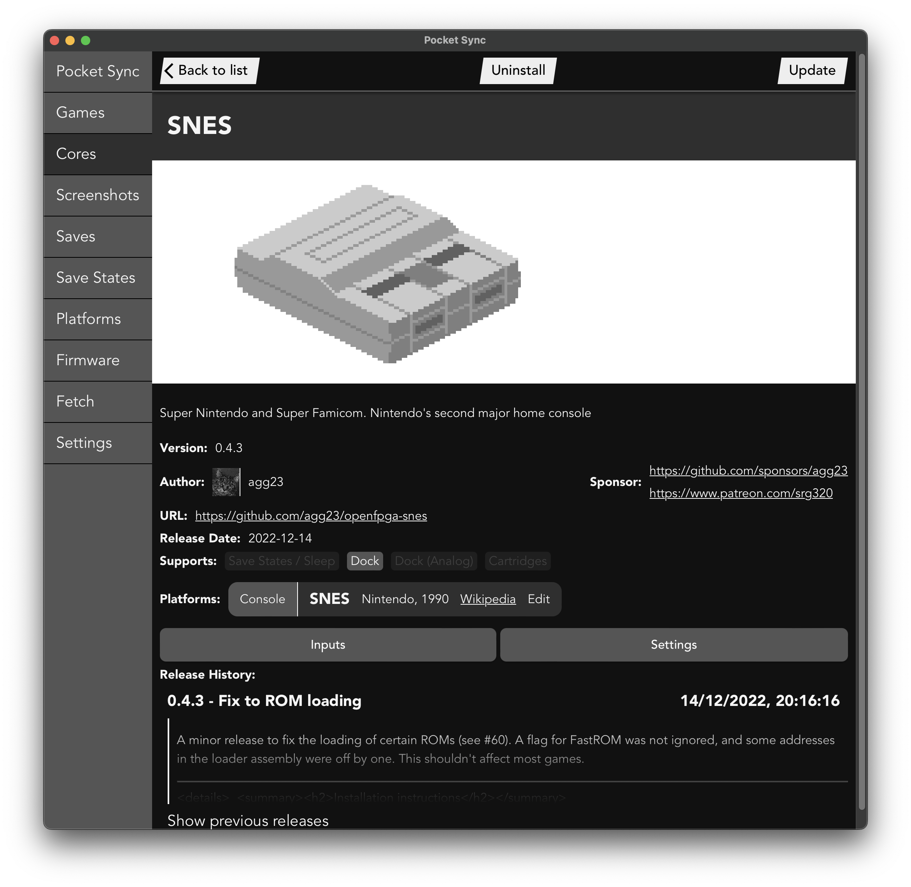
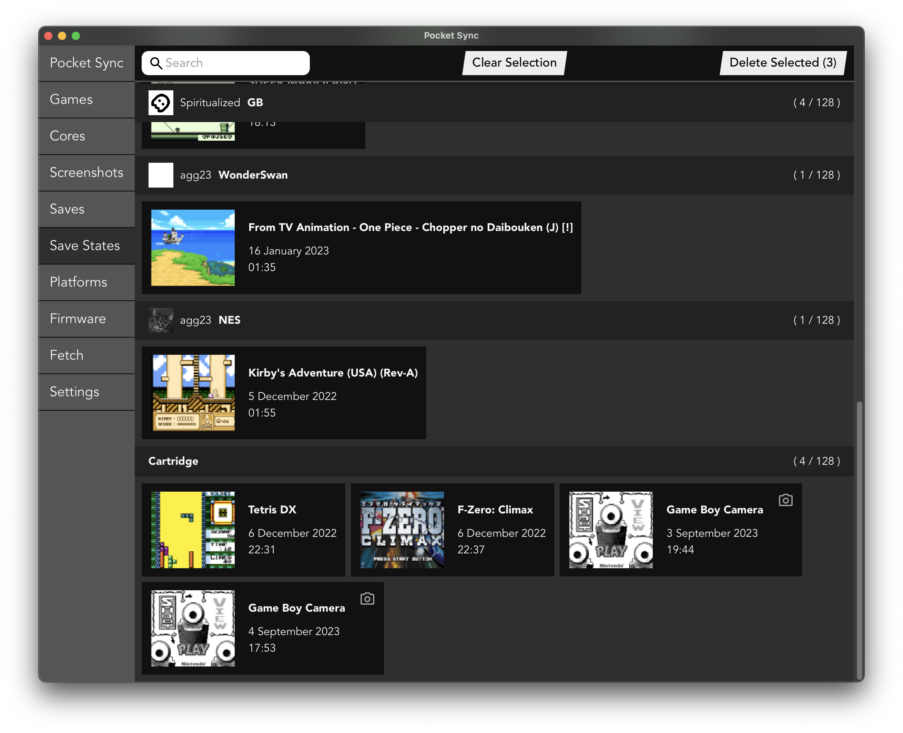

# pocket-sync

> "And fan-created apps let you load up a microSD card quickly and effortlessly."

 <a href="https://www.wired.com/review/analogue-pocket/#:~:text=And%C2%A0fan%2Dcreated%20apps%20let%20you%20load%20up%20a%20microSD%20card%20quickly%20and%20effortlessly">wired.com - Review: Analogue Pocket</a> 

A Windows / Mac / Linux GUI to do _stuff_ with the Analogue Pocket.

Features:

- Browse, configure, & install cores
- Export corrected & upscalled screenshots
- Backup & restore save files
- Quick links to open game file folders
- Browse & manage (bulk delete) save states

## Installation

- Download the installer for your platform from [The Latest Release](https://github.com/neil-morrison44/pocket-sync/releases/latest)
- Note you'll need to click through to allow the application on Windows & right click to allow the application on MacOS since I can't be bothered setting up (& paying yearly for) the signing process
- The SD card will need to have been initialised by the Pocket to get recognised
- Plug in your Pocket / put in the SD card, click "Connect to Pocket", select the root folder (the one with Assets & Cores & Saves etc in it) and go
- It'll slap a `pocket_sync.json` file on to your pocket to hold config on first run

## Philosophy

- What this purposely _isn't_ is a way to install 100 Cores in 20 seconds without really knowing what any of them are
- I'll not be adding any sort of "Install All" button to the UI, instead it's a slower process of choosing what cores you're interested in & seeing them, including links to support whoever put the time into getting the core onto the Pocket, in more detail. Also, with the number of cores coming from github now you'll run into rate limiting if you try and pull them all down at once. _(If you really want to just download every core at once I'd recommend the [mattpannella](https://github.com/mattpannella/pocket-updater-utility) / [RetroDriven](https://github.com/RetroDriven/Pocket_Updater) updaters for this over this one)_
- I'll not be supporting customising the `video.json` files (e.g. to add "Full Screen" modes), since I think this should be up to the core authors / users advanced enough to edit their own JSON (and deal with it if they break things). The app'll always allow you to opt out of any incoming `video.json` file though & if Analogue introduces a way to customise the video out without conflicting with the core author's files then I'll support it.

https://user-images.githubusercontent.com/2095051/204883337-f0e34a44-5ea4-47a4-9bd4-0865c287b58b.mov

## Roadmap

### Done

- Hopefully get the saves backups working how I'd planned (close enough)
- Support for adding custom images from PNGs, editing platform data, etc
- Improve Search
- Save State management (search, bulk delete etc)
- Input viewer
- Core settings
- Screenshot bulk delete / save
- Autobackup saves on connection (if there's changes)
- Input viewer supporting game specific inputs
- Settings supporting game specific settings

### Soon

- Installing / Checking for firmware updates (might wait for the real release of 1.1 for this)

### Longer term

- List new cores / updates since the last Pocket was connected (with, optional, notifications)
- Library viewing / editing once that's rolled out
- Add back MiSTer save file sync (don't really want to touch it if there's a chance I'll clopper MiSTer files with a bunch of incompatiable Genesis saves)

## FAQs

### Donations?

Nah, I'm alright - you should donate to the folks porting / building cores over though.

## Thanks to

- [The OpenFPGA Cores Inventory supplies a bunch of the data used in the app](https://github.com/openfpga-cores-inventory)
- [This recreation of the Analogue OS font](https://github.com/AbFarid/analogue-os-font)
