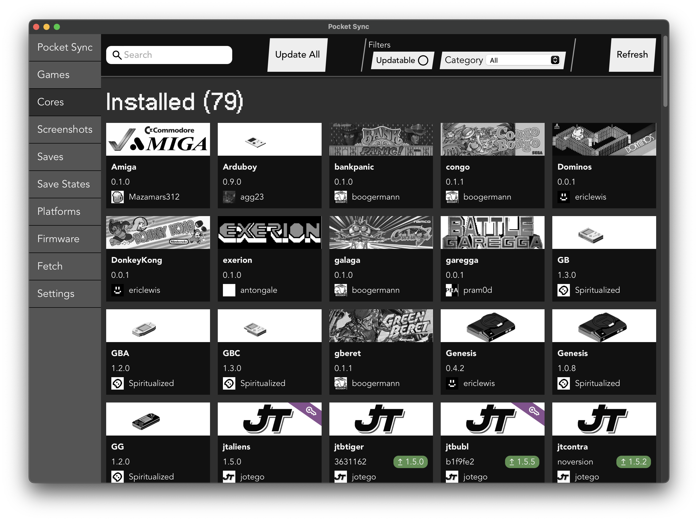

# pocket-sync

A Windows / Mac / Linx GUI to do _stuff_ with the Analogue Pocket.

Features:

- Browse & install cores
- Export corrected & upscalled screenshots
- Backup save files
- Quick links to open game file folders

## Roadmap

### Soon

- Installing / Checking for firmware updates

### Longer term

- Add back MiSTer save file sync (don't really want to touch it if there's a chance I'll clopper MiSTer files with a bunch of incompatiable Genesis saves)
